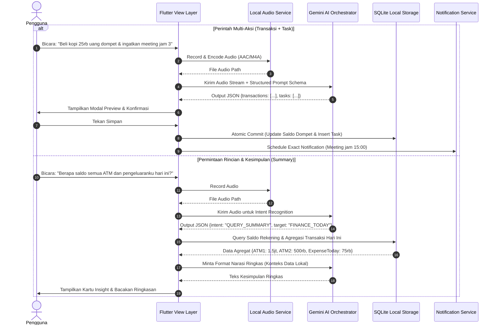
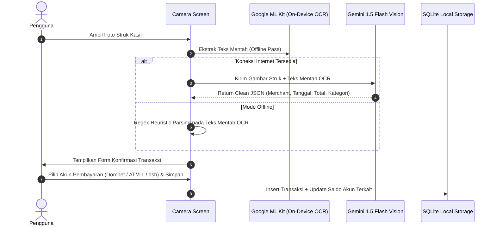
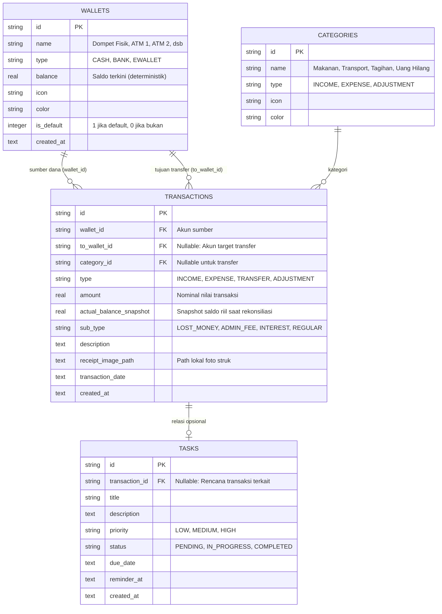

# PRD — SmartFlow: Asisten Pencatatan Keuangan Digital, Task Scheduler, Voice AI & Bill Snap

## 1. Overview
Pengelolaan keuangan personal dan jadwal aktivitas harian sering kali menghadapi friksi tinggi akibat proses pencatatan manual yang lambat dan terfragmentasi. Pengguna kerap mengalami inkonsistensi saldo antara catatan sistem dengan kondisi fisik riil (misalnya uang receh jatuh, selisih pengeluaran kecil, atau potongan administrasi/bunga bank yang tidak disadari).

**SmartFlow** dirancang sebagai solusi terpadu berbasis Android dengan filosofi *local-first deterministik*. Sistem ini mengintegrasikan:
1. **Multi-Account Financial Ledger**: Pencatatan uang masuk, uang keluar, transfer antar rekening (Dompet Tunai, ATM 1, ATM 2, E-Wallet), serta rekonsiliasi otomatis untuk kasus "uang hilang/selisih saldo".
2. **Scheduled Task List**: Manajemen agenda kerja dan pembayaran berkala dengan alarm notifikasi lokal.
3. **Camera Bill Snap**: Ekstraksi struk belanja fisik/digital secara presisi menggunakan kombinasi On-Device OCR dan Vision AI.
4. **Voice AI Orchestrator**: Pemrosesan perintah suara natural untuk input transaksi multi-entitas, penjadwalan tugas sekaligus, serta permintaan rincian analisis dan kesimpulan ringkas secara real-time.

Bagi sistem ini, kode, dependensi, dan arsitektur hanyalah alat. Yang penting adalah tujuannya tercapai dengan efisiensi matematis dan ketahanan data absolut.

---

## 2. Requirements

### 2.1. Persyaratan Platform & Aksesibilitas
- **Platform Sasaran**: Android (Minimum SDK: 26 / Android 8.0, Target SDK: 34 / Android 14).
- **Arsitektur Data**: *Local-First*. Semua transaksi dan tugas disimpan dalam penyimpanan lokal terstruktur; koneksi internet hanya digunakan saat memanggil inferensi Cloud AI.
- **Izin Sistem (Permissions)**:
  - `android.permission.CAMERA`: Pemindaian optik struk belanja dan tagihan.
  - `android.permission.RECORD_AUDIO`: Perekaman instruksi suara natural pengguna.
  - `android.permission.POST_NOTIFICATIONS`: Penayangan alert pengingat tugas harian.
  - `android.permission.SCHEDULE_EXACT_ALARM`: Penjadwalan alarm deterministik untuk batas waktu tugas.

### 2.2. Reliability & Edge-Case Protection
- **Operasi Offline Penuh**: Pengguna tetap dapat mencatat pemasukan, pengeluaran, transfer, rekonsiliasi dompet, dan task list tanpa internet.
- **Fail-Safe AI Parser**: Jika koneksi terputus saat proses Voice AI atau Camera Snap, data mentah (audio/gambar) tersimpan dalam antrean lokal (draft queue) tanpa menghilangkan input pengguna.
- **Integritas Transaksional (ACID)**: Seluruh kalkulasi saldo (mutasi transfer dan penyesuaian selisih) dibungkus dalam blok transaksi database guna mencegah inkonsistensi saldo.

---

## 3. Core Features

### 3.1. Multi-Account Ledger & Balance Adjustment (Uang Masuk, Keluar, & Uang Hilang)
- **Struktur Multi-Akun**: Mendukung segregasi wadah dana tanpa batas:
  - `Dompet Tunai (Cash)`
  - `ATM 1` (misal: BCA)
  - `ATM 2` (misal: Mandiri / BRI)
  - `E-Wallet` (misal: GoPay, OVO)
- **Tipe Mutasi**:
  - `INCOME`: Menambah saldo pada akun yang ditentukan.
  - `EXPENSE`: Mengurangi saldo pada akun yang ditentukan (contoh: Jajan Rp 10.000 dari Dompet Tunai).
  - `TRANSFER`: Perpindahan saldo antar-akun internal (misal: Tarik tunai Rp 100.000 dari ATM 1 ke Dompet) tanpa memengaruhi total kekayaan bersih.
  - `ADJUSTMENT (Fitur Uang Hilang / Selisih Saldo)`:
    - Pengguna memasukkan saldo riil yang tersisa saat ini (contoh: Dompet sisa Rp 30.000 dari catatan sistem Rp 50.000 setelah jajan).
    - Sistem secara otomatis menghitung selisih matematis:
      $$\Delta = \text{Saldo Riil} - \text{Saldo Sistem}$$
    - Mencatat mutasi selisih dengan label sub-kategori: *Uang Hilang / Receh Jatuh*, *Biaya Admin Bank*, *Bunga Tabungan*, atau *Koreksi Manual*.
    - Menyelaraskan saldo sistem langsung ke angka riil secara instan.

### 3.2. Scheduled Task List & Reminder
- Pencatatan tugas dengan metadata: judul, deskripsi, batas waktu (*due date*), prioritas (`LOW`, `MEDIUM`, `HIGH`), dan status (`PENDING`, `IN_PROGRESS`, `COMPLETED`).
- **Keterkaitan Finansial (Financial Binding)**: Opsi mengaitkan tugas dengan estimasi nominal transaksi (contoh: Task "Bayar Tagihan Listrik" terhubung dengan rencana pengeluaran Rp 250.000 dari ATM 1).
- **Exact Local Notification**: Notifikasi alarm otomatis berbasis waktu lokal perangkat.

### 3.3. Camera Bill Snap (OCR + Vision AI)
- Pemotretan struk kasir melalui kamera terintegrasi.
- **Dua Tahap Ekstraksi**:
  1. Tahap On-Device: Pra-pemrosesan gambar dan pembacaan teks awal menggunakan Google ML Kit Text Recognition.
  2. Tahap Vision AI (Gemini 1.5 Flash API): Normalisasi teks menjadi struktur data JSON deterministik (Nama Merchant, Tanggal, Item Pembelian, Pajak, Total Nominal).
- Layar verifikasi sebelum disimpan untuk memungkinkan pengguna mengoreksi data atau memilih sumber akun (Dompet atau ATM).

### 3.4. Voice AI Orchestrator (Multi-Task, Ledger & Kesimpulan)
- Perekaman suara satu ketukan (*tap-to-record*).
- **Kapabilitas Multi-Aksi**:
  - Ekstraksi transaksi majemuk dan jadwal sekaligus dalam 1 kalimat (contoh: *"Beli bensin 30 ribu pakai uang dompet dan jadwalkan servis motor besok jam 2 siang"*).
  - Ekstraksi penyesuaian saldo (contoh: *"Uang dompet sisa 30 ribu"*).
- **Mode Rincian & Kesimpulan (Summary & Insight)**:
  - Pengguna dapat meminta evaluasi data (contoh: *"Berapa total uang keluar minggu ini dan apa saja jadwalku besok?"*).
  - Sistem mengumpulkan data lokal, merangkumnya melalui AI, dan memberikan respons ringkas berupa teks dan audio feedback.

---

## 4. User Flow

```
+-------------------------------------------------------------+
|                      PENGGUNA MEMBUKA                       |
|                       APLIKASI SMARTFLOW                    |
+-------------------------------------------------------------+
                               |
        +----------------------+----------------------+
        |                                             |
        v                                             v
+------------------+                        +-------------------+
|   MODE MANUAL    |                        |   MODE SMART AI   |
+------------------+                        +-------------------+
        |                                             |
        |-- Tambah Transaksi                          +---------+---------+
        |   (Income/Expense/Transfer)                 |                   |
        |                                             v                   v
        |-- Update Saldo Riil                 +---------------+   +---------------+
        |   (Deteksi Uang Hilang)             |  CAMERA SNAP  |   |   VOICE AI    |
        |                                     +---------------+   +---------------+
        |-- Tambah Task Jadwal                        |                   |
        |                                       Ambil Foto Struk    Ucapkan Perintah
        |                                             |             (Multi-Action /
        |                                       ML Kit + Vision      Rekap/Summary)
        |                                             |                   |
        +----------------------+----------------------+                   v
                               |                                  Gemini NLU Parser
                               v                                          |
                      +------------------+                                |
                      | REVIEW & EDITING | <------------------------------+
                      | HASIL EKSTRAKSI  |
                      +------------------+
                               |
                         [Konfirmasi]
                               |
                               v
                     +--------------------+
                     | SIMPAN KE LOCAL DB |
                     +--------------------+
                               |
             +-----------------+-----------------+
             v                                   v
    +-----------------+                 +-----------------+
    |  UPDATE SALDO   |                 | DAFTARKAN ALARM |
    |   DOMPET/ATM    |                 |   NOTIFIKASI    |
    +-----------------+                 +-----------------+
```

---

## 5. Architecture

### 5.1. Sequence Diagram: Voice AI Multi-Action & Summarization



### 5.2. Sequence Diagram: Camera Bill Snap & OCR Flow



---

## 6. Database Schema

### 6.1. Entity-Relationship Diagram (ERD)



### 6.2. Kamus Data (Data Dictionary)

| Tabel | Kolom Kunci | Tipe Data | Deskripsi |
|---|---|---|---|
| `WALLETS` | `id`, `name`, `type`, `balance`, `is_default` | TEXT, REAL, INTEGER | Menyimpan akun rekening pengguna (*Dompet*, *ATM 1*, *ATM 2*). Saldo dimutasi secara atomik. |
| `CATEGORIES` | `id`, `name`, `type`, `icon` | TEXT | Klasifikasi transaksi (*Makanan*, *Transportasi*, *Gaji*, *Uang Hilang/Selisih*). |
| `TRANSACTIONS` | `id`, `wallet_id`, `to_wallet_id`, `type`, `amount`, `actual_balance_snapshot`, `sub_type` | TEXT, REAL | Rekaman mutasi keuangan. Mendukung transaksi internal transfer serta penyesuaian uang hilang (`ADJUSTMENT`). |
| `TASKS` | `id`, `transaction_id`, `title`, `priority`, `status`, `due_date`, `reminder_at` | TEXT | Daftar kegiatan dan jadwal pengguna dengan pengingat waktu alarm. |

---

## 7. Design & Technical Constraints

### 7.1. Technology Stack
- **Framework**: Flutter 3.x (Dart 3.x), dioptimalkan untuk performa native Android 64-bit.
- **State Management**: BLoC / Cubit atau Riverpod untuk kontrol alur data yang terisolasi dan mudah diuji (*testable*).
- **Database Mesin Lokal**: `sqflite` (SQLite Engine) dengan Foreign Key enforcement dan Database Transactions.
- **Pemrosesan Gambar & OCR**:
  - `camera` / `image_picker`: Akuisisi gambar struk beresolusi tinggi.
  - `google_mlkit_text_recognition`: OCR lokal on-device.
- **Integrasi Artificial Intelligence**:
  - `google_generative_ai`: SDK resmi Gemini API (menggunakan model `gemini-1.5-flash` untuk latensi rendah pada penalaran suara dan ekstraksi struk multimodal).
- **Penjadwalan & Notifikasi**:
  - `flutter_local_notifications`: Penjadwalan notifikasi alarm presisi.
  - `timezone`: Penanganan zona waktu akurat pada alarm Android.
- **Audio Capture**:
  - `record`: Perekaman audio lokal dengan kompresi hemat ukuran (AAC/M4A).

### 7.2. Aturan Format JSON AI (Structured Output Constraint)
Model AI Gemini diwajibkan mengembalikan JSON valid tanpa format markdown tambahan untuk memastikan integritas parsing:
```json
{
  "intent": "TRANSACTION_ENTRY" | "TASK_ENTRY" | "MULTI_ACTION" | "BALANCE_ADJUSTMENT" | "SUMMARY_QUERY",
  "transactions": [
    {
      "wallet_name": "Dompet" | "ATM 1" | "ATM 2",
      "type": "EXPENSE" | "INCOME" | "TRANSFER" | "ADJUSTMENT",
      "amount": 10000,
      "category": "Jajan",
      "notes": "Beli jajan",
      "target_actual_balance": null
    }
  ],
  "tasks": [
    {
      "title": "Servis Motor",
      "due_date": "2026-09-13T14:00:00",
      "priority": "MEDIUM"
    }
  ],
  "summary_request": {
    "is_requested": false,
    "query_target": null
  },
  "natural_response": "Pencatatan jajan Rp10.000 dari Dompet dan jadwal servis motor berhasil diproses."
}
```

### 7.3. UI/UX Guidelines
- **Tema Visual**: Material 3 dengan dukungan Dark Theme dan Light Theme otomatis.
- **Aksesibilitas Satu Sentuhan**: Tombol utama mengambang (*Floating Action Button*) untuk memicu menu cepat: *Snap Struk*, *Voice AI*, *Catat Transaksi*, dan *Tambah Jadwal*.
- **Konfirmasi Transparan**: Semua aksi otomatis dari Voice AI dan Camera Snap wajib melalui pratinjau sebelum dieksekusi ke database. Tidak boleh ada mutasi data diam-diam tanpa verifikasi visual pengguna.

---

Semua variabel teknis dan spesifikasi fungsional telah terdokumentasi secara lengkap dan steril dalam berkas ini.
